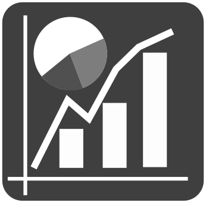
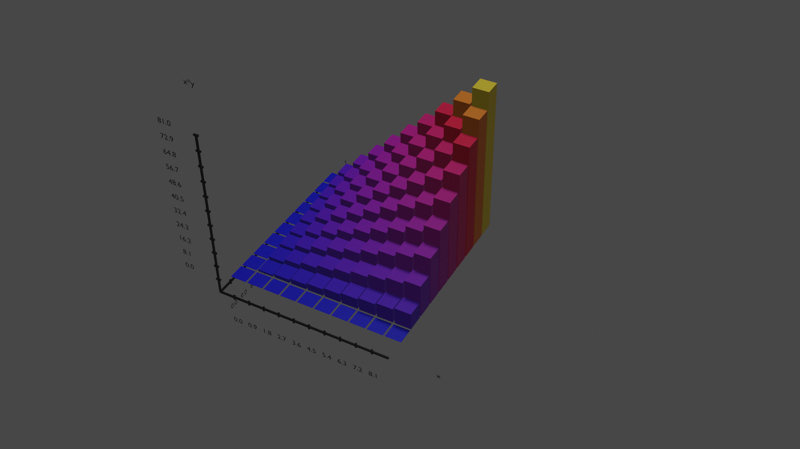
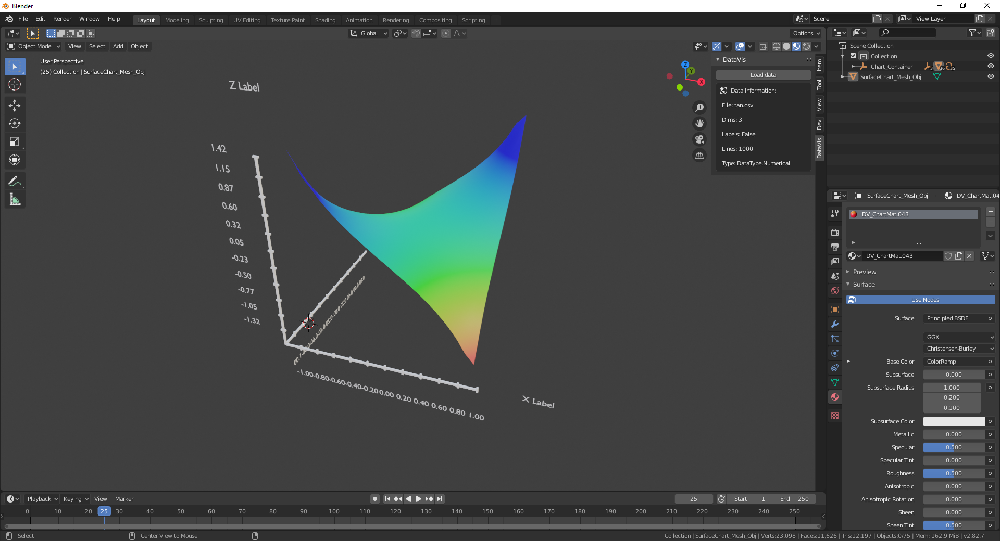

<p align="center">
    
    
</p>
<h3 align="center">
    Data visualisation addon for blender
</h3>
<p align="center">
Load data into Blender and create visualisations!
</p>

## Quickstart
Download `data_vis.zip` and install it in Blender (Edit -> Preferences -> Addons). Or get the folder `data_vis` (from repo or the zip) and move it into blender addons directory manually.
<p align="center">
    
</p>

## Introduction
Brief section about how to use the addon and what principles are applied to data and visualisations and how addon works. Addon extends Blender UI in two places:
- Add Object Menu - Create new visualisations under Chart subgroup (Shift + A)
- View3D Tools - Manipulate with data and some properties (N)

Addon uses Blender coordinate system, 2D chart is generated along X and Z axis, 3D charts extend along Y axis. Form of chart creation and parametrization is inspired by matplotlib. I tried to make chart creation simple but customizable.

### CSV Format
Addon supports values separated by `, (commas)`
Data are in `X, Y, [Z]` format, where each entry is on new line. First line can contain labels for axis.
Two types of data are supported:

Categorical `X, Y` X is category and Y is e. g. X occurence 
```
species, occurance
dogs, 5
cats, 10
parrots, 2
```
Numerical `X, Y, [Z]` are numerical values.
```
x, sin(x)
0, 0.0
0.785, 0.706
1.57, 0.99
3.14, 0.0
```

```
x, y, x + y
0, 0, 0
0, 1, 1
1, 0, 1
1, 1, 2
```

### Creating chart
Use add object menu and select chart which suits your needs. If you set data type and dimensions correctly, chart should create with automatic axis ranges and steps and default coloring. You can try to play with parameters and if you can come up with something cool.
All charts sizes are normalized to 1, e. g. you can create stem chart by using bar and point chart or dual-line chart by creating two line charts with proper settings.

Surface chart is supported only if you install scipy and numpy into Blenders python.
This can be done in addon preferences (experimental) or in system console using pip.

## Status
Currently supported features:
- Pie chart (Categorical)
- Line chart (Categorical, Numeric)
- Bar chart (Categorical, 2D Numeric, 3D Numeric)
- Point chart (2D Numeric, 3D Numeric)
- Surface chart (Using scipy)
- Creating axis with labels from charts
- Ranges of data to visualise can be set
- Materials and 3 types of coloring of charts (Including default Node Shader for gradients and random colors)


Known issues:
- Charts from larger files (>200 entries) take long time to generate (except surface chart), because of large numbers of manipulations with objects instead of meshes

Planned features:
- Muliple categories for categorical charts
- Animations between timestamps in data
- Label alignment to camera for render

Feel free to submit any issues or ideas!

## Possible results
<p align="center">
    
    
</p>

## Author
Zdeněk Doležal - Bachelor Thesis

Faculty of information technology BUT

Version 1.1
