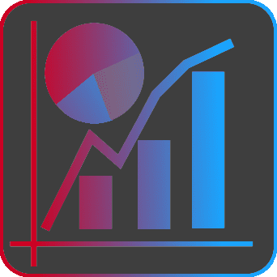

<p align="center">
    
    
</p>
<h3 align="center">
    Data visualisation addon for blender
</h3>
<p align="center">
    Load data into Blender and create visualisations!
</p>
<p align="center">
    <a href="https://griperis.github.io/BlenderDataVis/">Documentation</a> |
    <a href="https://youtu.be/qIF7QPu2cOI">Video</a> |
    <a href="https://blendermarket.com/products/data-visualisation-addon">Blender Market</a> |
    <a href="https://griperis.gumroad.com/l/data-vis">Gumroad</a> |
    <a href="https://www.buymeacoffee.com/griperis">Buy me a coffee</a>
</p>

> [!TIP]
> The 3.0.0 version using geometry nodes is now released. Charts are now procedural, more adjustable and the addon is several times quicker. All geometry, axis labels and values are updated in **real time**!

## Quickstart
Download `data_vis.zip` and install it in Blender (Edit -> Preferences -> Addons). Or get the folder `data_vis` (from repo or the zip) and move it into blender addons directory manually.
<p align="center">
    
</p>


## Introduction
Addon extends Blender UI in two places:
- Add Object Menu - Create new visualisations under Chart subgroup (Shift + A)
- View3D Tools - Manipulate with data and some properties (N - DataVis tab) - this position can be edited in settings

Addon uses Blender coordinate system, 2D chart is generated along X and Z axis, 3D charts extend along Y axis. Form of chart creation and parametrization is inspired by matplotlib.
Chart data are loaded into scene as a mesh with vertices on the data positions, then a couple of geometry node modifiers wrangles the data into a chart with axis and other components.

### CSV Format
Addon supports values separated by `, (commas)`
Data are in `X, Y, [Z]` format, where each entry is on new line. First line can contain labels for axis.
Two types of data are supported:

Categorical `X, Y` X is category and Y is e. g. X occurence 
```
species, occurance
dogs, 5
cats, 10
parrots, 2
```
Numerical `X, Y, [Z]` are numerical values.
```
x, sin(x)
0, 0.0
0.785, 0.706
1.57, 0.99
3.14, 0.0
```

```
x, y, x + y
0, 0, 0
0, 1, 1
1, 0, 1
1, 1, 2
```

Data also can have multiple top values  `Z in t, t + 1, t + 2`. There is a possibility to create animation and keyframes for each data and interpolate between it. (Supported for Bar, Point and Surface chart)
```
x, y, x + y
0, 0, 0, 3, 10
0, 1, 1, 4, 0
1, 0, 1, 5, 3
1, 1, 2, 1, 2
```

### Creating chart
Load data in the N-panel or use example data. Add the chart using the `Create Chart` operator
or the `Add Object Menu`. Chart object will be created, where afterwards in `N-panel` you can add components like axis, labels or limit the data range. You can create two or more charts object and combine them to a more complex chart. Charts are normalized to a container, which size can be adjusted (by default scaled to 1 meter cube) in the `N-Panel` or modifiers. Materials are customizable through shaders.

Surface chart is supported only if you install scipy and numpy into Blenders python.
This can be done in addon preferences or in a system console using pip.

If for any reason you don't want to use the geometry nodes introduced in `3.0` you can switch to `Legacy Mode` in the addon header and use it as previously. 

## Status
Currently supported features:
- Procedural charts:
  - Pie chart (Categorical)
  - Line chart (Categorical, Numeric)
  - Bar chart (Categorical, 2D Numeric, 3D Numeric)
  - Point chart / Scatterplot (2D Numeric, 3D Numeric)
  - Surface chart (Using scipy, installed through preferences)
- Creating axis with labels from data procedurally
- Ranges of data to visualise can be set procedurally
- Preset materials customizable through attributes
- Animations of data, axis, labels and components 
- Panel settings (to prevent sidebar cluster)
- Loaded data list
- Data inspector
- Label alignment using Geometry Nodes
- Example data available in addon
  
Planned features:
- Multiple categories for categorical charts
- Function plotting
- Improvements to animation

Feel free to submit any issues or ideas!

## Author
Zdeněk Doležal

Developed as a Bachelor Thesis at Faculty of information technology BUT.

Version 3.0.0
