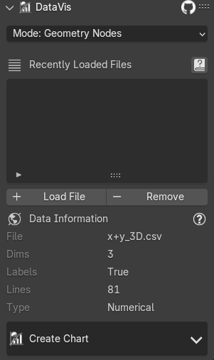
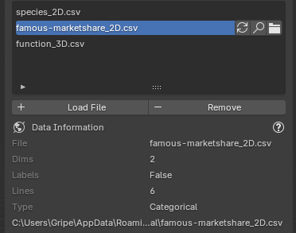
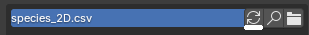
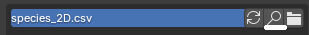
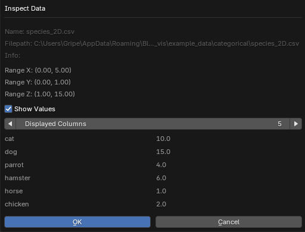
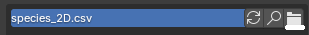

# Data

## Supported Data Formats
Currently only `CSV` files are supported. The data have to be separated by `,` (comma).
The first line can **contain labels** for each axis. There can be arbitrary amount of columns
in the `.csv` file.

```
x,y,z <--- labels for axis
0,0,0 <--- first point values
1,1,1 <--- secound point values
...
```


### Available Data Types
Based on the selected `Data Type` when creating the chart a different portion of the data
will be used.

| Data Type           | Format                                   | Description                                                                                   |
|---------------------|------------------------------------------|-----------------------------------------------------------------------------------------------|
| **2D**             | `x,z`                                   | Two values on *XZ* plane.                                                                     |
| **2D Animated**        | `x,z(t),z(t+1),z(t+2),...`              | Two values and *Z* values for animation on *XZ* plane.                                        |
| **2D+W**           | `x,z,w`                                 | Two values on *XZ* plane and third *W* used for additional chart parameters (currently only size in point chart). |
| **3D**             | `x,y,z`                                 | Three values on *XYZ* plane.                                                                  |
| **3D+W**           | `x,y,z,w`                               | Three values on *XYZ* plane and fourth *W* used for additional chart parameters (currently only size in point chart). |
| **3D Animated**        | `x,y,z(t),z(t+1),z(t+2),...`            | Three values and values for *Z* animation on *XYZ* plane.                                     |
| **Categoric 2D**   | `str,z`                                 | String *X* axis labels, their corresponding *Z* values.                                       |
| **Categoric 2D Animated**| `str,z(t),z(t+1),z(t+2),...`            | String *X* axis labels, their corresponding *Z* values and values for *Z* animation.          |

??? tip "Example Data"
    You can try sample data directly within the addon. Choose between several examples of categorical and numerical data.
    
    

## Data List
All loaded data files are displayed in the data list, the active item in the list is used for creating charts.

You can find more information about the data in the `Data Information` section.



### Loading Data
Press the `Load Data` button, select `.csv` file according to [supported data formats](#supported-data-formats) and
it should appear in the [data list](#data-list).


???+ info "Reload Data"
    
    
    Data is loaded into the addon when `Load Data` is clicked. If the source file changed on the disk in between you can use the `Reload Data` operator to *fetch* new data from the file. 


???+ info "Data Inspector"
    
    
    Currently loaded data can be viewed directly from Blender with additional info and options to show values of the data loaded into the addon.

    


???+ info "Open Data"
    
    
    Open the data file with program associated to open the `.csv` files extension.
