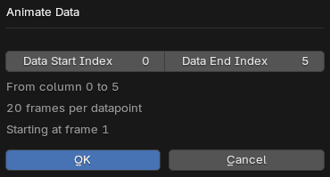

# Animations

Data, axis and data labels can be animated using a preset directly from the addon panel.

???+ tip "Animate Modifier Properties"
    Custom animations of individual components can be achieved by keyframing the properties of the geometry nodes modifiers.
    Just keyframe the property using the `I` button and adjust in `FCurve Editor`. 

Data can be animated by the `Data Animation` button.

Feature animations can be tweaked by the `Curve` icon button next to individual features.

???+ info "Animations are based on `Current Frame`"
    All animations created by the addon are started at the `Current Frame` of the scene. To start animating
    from a different frame, adjust the `Current Frame` of the scene.

???+ tip "Adding Both In and Out Effect"
    1. Add any animation with `Reversed` when you want the in effect to start (Mark it as `Current Frame`)
    2. Add animation (without `Reversed`) when you want to start the out effect with `Current Frame` 

## Common Properties
Feature animations and data entry animations share following common properties:

| Property        | Description                                                                 |
|-----------------|-----------------------------------------------------------------------------|
| Animation Type  | Specifies the type of animation applied (Grow, Explode, ...).   |
| Interpolation   | Determines how values transition between keyframes (e.g., linear, cubic, bounce). |
| Reverse         | Plays the animation in reverse direction.                                   |
| Duration        | Sets how long the animation lasts (in frames).                   |

## Data Animations

???+ warning "Chart has to be created as **Animated**"
    In order to enable the `Animate Data` button, the chart has to have suitable data and has to be created as animated.
    Creating chart as animated create shape keys based on different columns of the `Z[t], Z[t+1], ...` values.

After clicking the animation button, a popup is shown, where you can select which columns to animate and shows you information
about the crated animation.

This will create keyframes on the data mesh `Shape Keys`, which control the value and the data points will be animated.