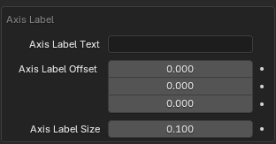

# Axis

Individual axis can be added by the `+` button in the header with a custom configuration. For ease of use axis can be added directly in the panel for separate axis based on the created charts.  

## Axis Types

### Numeric Axis
Display numeric values between min and max with certain step. Fully procedural, can take automatic ranges from different axis.

### Categoric Axis
Display labels passed to the modifier (`Labels` input) on the axis with equidistant steps.

Compared to [Numeric Axis](#numeric-axis), this has `Tick Every` and `Labels` inputs.

| Parameter     | Description |
|---------------|-------------|
| Tick Every  | How frequently tick should be created. |
| Tick Count  | How many labels are present for ticks. |
| Labels | Comma separated labels. These get parsed and instantiated at individual ticks positions. Automatically populated by the addon, when creating the axis based on data. |  

## Range and values

Axis range is based on the `Range Source` parameter, for custom axis range select `Custom Range` and then you can tweak all the axis options. When using automatic axis, the values are taken from the [Data Modifier](../charts.md#data-modifier).

## Axis Parameters

| Parameter     | Description |
|---------------|-------------|
| Length        | Lenth of the axis. |
| Range Source  | Where the source min and max is taken from. `Custom Range` can be used for arbitrary values. When creating axis from the addon, this is automatically set up based on the selected axis. |
| Thickness     | Thickness of the axis. |
| Tick Height   | Height of the individual ticks. |
| Rotation      | Rotation of the axis, set automatically when axis is created from the addon. |
| Offset        | Offset of the axis from the center of the chart. |
| Min           | Minimum to use with `Custom Range`. |
| Max           | Maximum to use with `Custom Range`. |
| Step          | Numeric step of the axis - how frequent the ticks should be created. |

## Labels / Ticks

| Parameter     | Description |
|---------------|-------------|
| Label Offset          | Offset of the labels of individual values. |
| Label Rotation        | Rotate the individual labels. |
| Label Size            | Size of the labels. |
| Label Decimals        | Number of decimals displayed. |
| Labels Alignment      | Toggle to align labels to `Labels Align Object`. |
| Labels Align Object   | Object to what transform the labels will be aligned. |

## Axis Label

| Parameter     | Description |
|---------------|-------------|
| Axis Label        | Text label to be displayed. |
| Axis Label Offset | Offset of the from the center. |
| Axis Label Size   | Size of the label. |

## Materials

| Parameter     | Description |
|---------------|-------------|
| Ticks Material   | Material for individual ticks. |
| Labels Material  | Material for labels. |
| Axis Material    | Material for the axis geometry. |