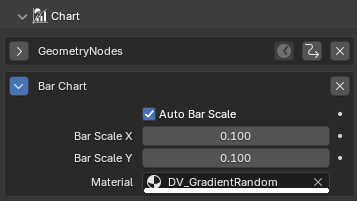
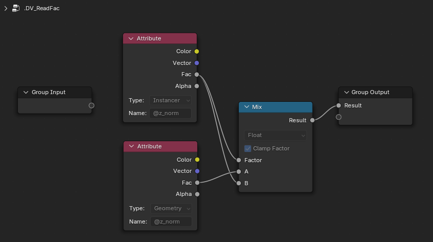
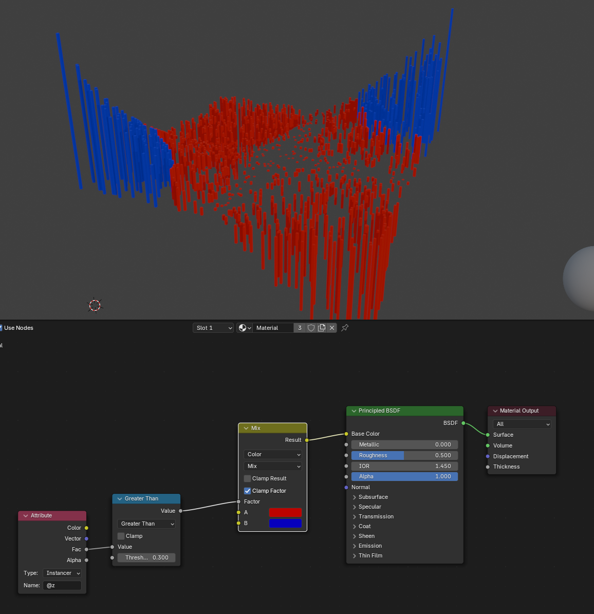

# Color
All presets are based on `Base Color` that's can be chosen when creating chart.
Following color presets are available directly in the addons as predefined materials.

| Preset Name      | Description                                                                 |
|-------------------|-----------------------------------------------------------------------------|
| Gradient          | Smooth transition between colors based on normalized values.                                        |
| GradientRandom    | A gradient with randomly selected colors.                                 |
| HueRandom         | Random values with different hue near the `Base Color`.                                        |
| Constant          | A single, constant color for all elements.                                |
| Sign              | Colors based on the sign (positive/negative) of the data values.          |

## Customizing color
Custom material can be used. Create a material and assign it to the `Material` input
in the `DataVis` panel or in the modifier panel.

The generated chart mesh contains various attributes that you can use to customize the color.
Use the `Attribute` node to read the attributes.

| Attribute Name | Description                                                                 |
|----------------|-----------------------------------------------------------------------------|
| `@z`        | *(Float)* The `z` value of the data.                                |
| `@z_norm`        | *(Float)* Normalized `z` value of the data to 0-1 range.                                   |
| `@min`         | *(Vector)* Minimum of the data.         |
| `@max`     | *(Vector)* Maximum of the data.               |
| `@scale`     | *(Vector)* Scale of the container size for the chart.                               |

???+ warning "Attribute Type"
    When using the `Attribute` node, some charts use `Instancer` type, other's need `Geometry` type.
    You can use the `.DV_ReadFac` node group that returns the used attribute or implement your own.
    
    

For example you can highlight certain values by using the `@z` attribute and several other nodes.

