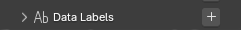
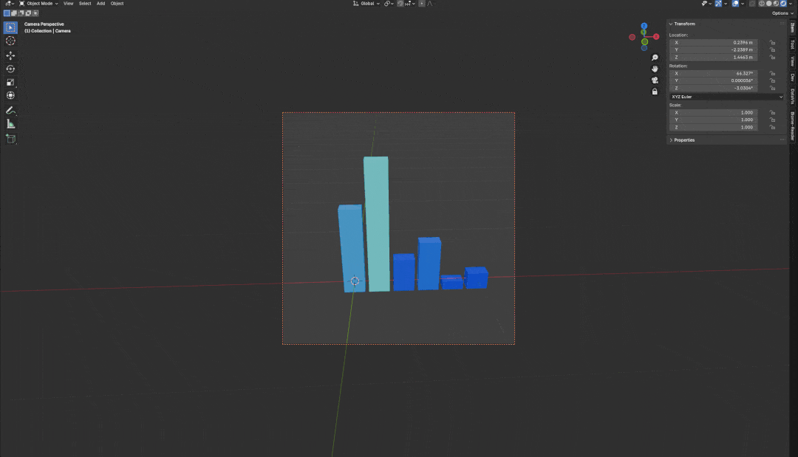

# Data Labels

Labels showing the value of the data points can be added using the `+` in the header of the `Data Labels` panel.

## Follow Camera

Labels above data can follow camera (or any object transform). Select the camera as `Labels Align Object` and toggle `Labels Alignment`. 

