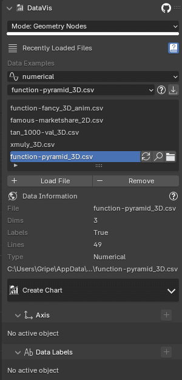

# Legacy Mode
`DataVis` before 3.0 used a different approach to creating charts - the individual objects were created and added into your scene.
If this workflow fit you better, it's still in the addon.

You can switch easily by toggling the `Addon Mode` in top of the panel to `Legacy`.

???+ info "Compatibility"
    Charts between version 2.0 and 3.0 are not compatible between each other. Both charts can exist in the scene at
    the same time, but you won't be able to add `geometry nodes axis` to chart created in `legacy` mode.