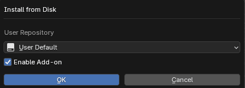
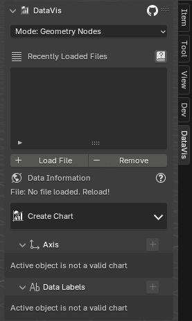
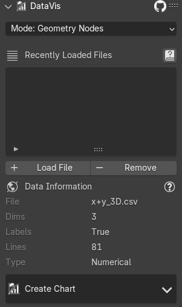
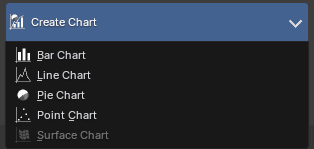
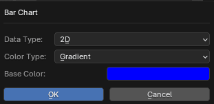
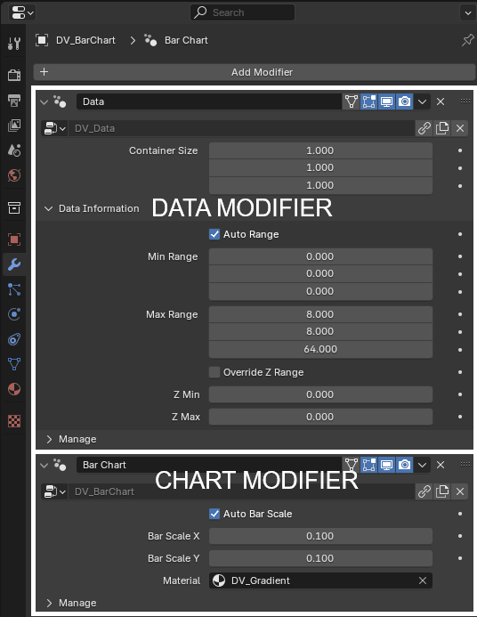

# Quickstart

## Installation

Download the `data_vis_VERSION.zip` from `BlenderMarket`, `Gumroad` or `Github`.
Either drag & drop it into Blender or install in Blender preferences.

Open Blender preferences (`Edit` -> `Preferences` -> `Addons`). Click `Install from Disk` in the dropdown, select the `.zip` file and confirm.

???+ tip "Drag & Drop Installation"
    Drag the `.zip` into Blender's window, choose user repository and confirm
    

On successfull installation you should see `DataVis` panel in the `N` panel of `3D View`.

Consult official Blender [addon installation documentation](https://docs.blender.org/manual/en/4.2/editors/preferences/addons.html#add-ons) for more information.

## Creating Chart
Load custom data according to [supported data formats](data.md#supported-data-formats) or use one of the data examples. Then you should see loaded data in the data list. 

Start creating a chart by expanding the `Create Chart` menu.

After selecting a chart a menu is shown - you can select how to interpret your data
and some basic settings like base color.

Object with **data and chart modifier** will be spawned in your scene.
The object's mesh contains your data points and the modifiers that create chart geometry.

???+ info "Chart Operators work on Active Object"
    Animations, adding axis, labels and other features work based on the **Active Object**.
    The active object has to be a chart created through the addon for the other features to work.

???+ info "Tweaking Data Range"
    You can find the `Data` modifier either in the `Charts` panel or `Modifiers` of the object.
    Use `Container Size` to change the size of the chart. By toggling `Auto Range` you can adjust what data points are considered.

???+ info "Tweaking Chart Specific Settings"
    Similarly to tweaking data range, you can find `Chart` modifier allowing you to tweak chart specific settings like bar size, or materials.

## Adding Axis
Add individual axis inside the panel by one click or custom axis by clicking the `+` in the header of the `Axis` panel.

???+ info "Tweaking Properties"
    Each axis is an additional geometry nodes modifier. Properties can be tweaked in the `N` panel or in the `Modifiers` panel.

## Adding Data Labels
Add data labels by clicking `+` in the header of the `Data Labels` panel and tweak it in the panel afterwards.

???+ info "Tweaking Properties"
    Data labels are an additional geometry nodes modifier. Properties can be tweaked in the `N` panel or in the `Modifiers` panel.

## Adding Animation
Animation can be added by clicking the `clock` icon in the `Chart` panel.

???+ warning "Chart has to be created animated"
    In order for data animation to work, the chart has to be created in `3D+Animation` or `2D+Animation` data modes! If the chart is not created animated, it's only possible to animate in-out transitions.

## 2D
Creating 2D charts is possible by adding [2D data](./data.md#supported-data-formats), or subsetting 3D data.
Visualising in 2D is preffered, as it doesn't induce any perspective distortion to the data values and
the same value in the chart is displayed at the same position. It's suggested to use `Orthographic` camera.